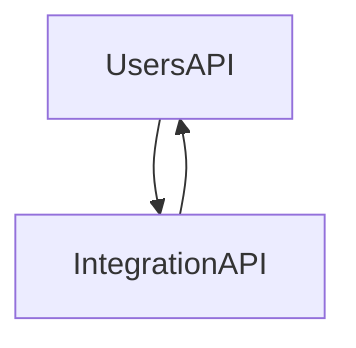

# Thiago Batista Project - Frontend

Welcome to the frontend component of the Thiago Batista project for the Sysamp bootcamp. This repository contains the frontend application built using React, TypeScript, and Vite.

## System Architecture

Below is a simplified Mermaid diagram illustrating the interaction between different components:



Ensure you have Node.js and npm installed on your machine to handle frontend dependencies efficiently.

## Setup Guide

Follow these steps to get the frontend project running locally:

### Clone the Project

```bash
git clone https://github.com/bc-fullstack-04/thiago-batista-frontend.git
```

### Install Dependencies

Navigate to the project directory and install dependencies using npm:

```bash
cd thiago-batista-frontend
npm install
```

### Launch the Development Server

Start the development server using npm:

```bash
npm run dev
```

After executing these commands, the frontend application should be accessible in your browser at http://localhost:3000.

## API Documentation

To explore API functionalities, visit the Swagger documentation for each API:

- Users API: [Swagger UI for Users API](http://localhost:8081/swagger)
- Integration API: [Swagger UI for Integration API](http://localhost:8082/swagger)

## Ports Used

- Users API: Running on port 8081
- Integration API: Running on port 8082

## React + TypeScript + Vite

This template provides a minimal setup to get React working in Vite with Hot Module Replacement (HMR) and some ESLint rules.

Currently, two official plugins are available:

- @vitejs/plugin-react uses Babel for Fast Refresh
- @vitejs/plugin-react-swc uses SWC for Fast Refresh

## Expanding the ESLint Configuration

If you are developing a production application, we recommend updating the ESLint configuration to enable type-aware lint rules:

- Configure the top-level `parserOptions` property as follows:

```javascript
export default {
  // other rules...
  parserOptions: {
    ecmaVersion: 'latest',
    sourceType: 'module',
    project: ['./tsconfig.json', './tsconfig.node.json'],
    tsconfigRootDir: __dirname,
  },
}
```

- Replace `plugin:@typescript-eslint/recommended` with `plugin:@typescript-eslint/recommended-type-checked` or `plugin:@typescript-eslint/strict-type-checked`
- Optionally add `plugin:@typescript-eslint/stylistic-type-checked`
- Install `eslint-plugin-react` and add `plugin:react/recommended` & `plugin:react/jsx-runtime` to the `extends` list

---
